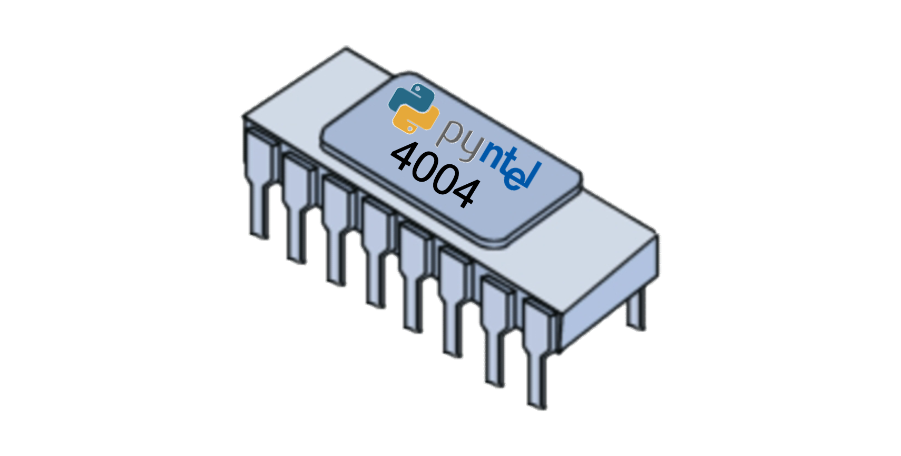

# Pyntel4004
A Python software implementation of the Intel 4004 processor.

## General Information
- Two pass assembler using the original mnemonics, directives and comments syntax
- Monitor facility to step through code and examine registers, memory etc

## Design goals
[ ] As much of the internals as possible should be carried out using binary arithmetic and operations
[ ] No external libraries to be used (i.e. pure Python)
[ ] Build a fully-working i4004 opcode emulator
[ ] Build a fully-working assembler which generates correct op-codes
[ ] Construct a fully-working i4004 chip which can use the generated object code from the compiler (possibly using micro-python or circuit python on an Ardiuno Board)

## Monitor Commands

| Command | Example | Meaning |
|---------|---------|---------|
| "Enter" | "Enter" | Execute the current instruction and move to the next |
|  acc   |   acc    | Show the current contents of the Accumulator |
|  off    |  off    | Continue to execute the program with no trace |
|   pc    |   pc    | Show the Program Counter |
|    q    |    q    | Quit the monitor without executing any further commands |
|  reg *n*  |  reg 7  | Show content of a specified register |
|  regs   |  regs   | Show all 16 registers |
| stack   |  stack  | Show the stack and the location of the stack pointer |

