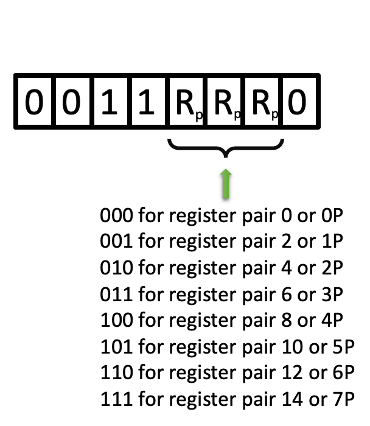

.. _hardware-machine-fin:

FIN
===

.. include:: ../../global.rst

.. toctree::
   :hidden:

.. list-table::
   :widths: 25 75
   :header-rows: 0

   * - Name
     - Fetch Indirect from ROM
   * - Function
     - 8 bits of immediate data are loaded into the register pair specified by RP.
   * - Syntax
     - FIN  RPp
   * - Assembled
     -
   * - Binary
     - 0010RRR0
   * - Decimal
     - 48, then incrementing by 2 until 62 (1st word)
   * - Hexadecimal
     - 0x30, then incrementing by 2 until 0x3E (1st word)
   * - Symbolic
     - .. image:: images/fin-sym.png
          :scale: 50%
   * - Execution
     - 1 word, 8-bit code but with an execution time of 21.6 |mu| sec
   * - Side-effects
     - Not Applicable, unless RP0 is the designated target register pair,
       in which case, RP0 will contain the data at the memory location
       referenced by RP0 at the start of the instruction
   * - Implemented
     - fin_

.. rubric:: Detailed Description

The contents of registers 0 and 1 are concatenated to form the lower 8 bits
of a ROM or program RAM address. The upper 4 bits of the address are assumed
equal to the upper 4 bits of the address at which the **FIN** instruction is
located (that is, the address of the **FIN** instruction and the address
referenced by registers 0 and 1 are on the same page).
The 8 bits at the designated address are loaded into the register pair
specified by RP. The 8 bits at the designated address are unaffected; the
contents of registers 0 and 1 are unaffected unless RP = O.

The carry bit is not affected.

The target register pair is defined as part of the opcode as detailed below.

.. rubric:: Example program

::

    / Example program
            org    ram
            fin    7p
            end

(Assume that address 0x25B contains the data 0x6E (spread over 2 words)).

If register 0 contains 0x5 and register 1 contains 0xB, when the FIN instruction
is executed, the 8 bits located at hex address 0x25B will be loaded into register
pair 7P. Thus register 14 will contain 0x6, and register 15 will contain
0xE.

.. rubric:: Notes

If a FIN instruction is located in the last location of a page, the upper
4 bits of the designated address will be assumed equal to the upper 4 bits
of the next page.

Thus if the instruction:

::

            fin 7p

is located at decimal address 511 (0x1FF) and registers 0 and 1 contain 3 and
0xC, the 8 bits at address **0x23C** (not 0x13C) will be loaded into registers
14 and 15.

**This is dangerous programming practice and should be avoided whenever possible.**

.. _fin: https://github.com/alshapton/Pyntel4004/blob/5e9f4253d8a412f6a3ec8fca5e3acfc88e0861c3/pyntel4004/src/hardware/machine.py#L389
