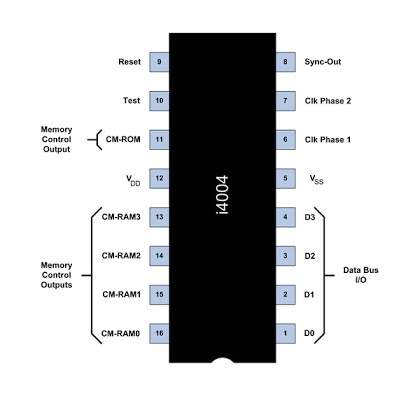

.. _hardware-machine-jcn:

JCN
===
.. include:: ../../global.rst

.. toctree::
   :hidden:

.. list-table::
   :widths: 25 75
   :header-rows: 0

   * - Name
     - Jump Conditional
   * - Function
     - Jump if satisfying a set of conditions
   * - Syntax
     - JCN
   * - Assembled
     -
   * - Binary
     - 0001 CCCC AAAAAAAA
   * - Decimal
     - 16 - 31 (1st word)
   * - Hexadecimal
     - 0x10 - 0x21 (1st word)
   * - Symbolic
     - .. image:: images/jcn-sym.png
   * - Execution
     - 1 word, 8-bit code and an execution time of 10.8 |mu| sec
   * - Side-effects
     - Not Applicable
   * - Implemented
     - imp_

.. rubric:: Detailed Description

If the condition specified by C\ :sub:`x`\  is false, no action occurs and program execution continues with the next sequential instruction. If the condition specified by
C\ :sub:`x`\  is true, the 8 bits specified by AAAA replace the lower 8 bits of the program counter. The highest 4 bits of the program counter are unchanged. Therefore, program execution continues at the specified address on the same page of memory in which the JCN instruction is located. The carry bit is not affected.

The condition code is specified in the assembly language statement as a decimal value from 0 to 15, which is represented in the assembled instruction as the corresponding 4 bit hexadecimal digit. meaning, as follows:

More than one condition at a time may be tested.
If the leftmost bit of the condition code is zero, a jump occurs if any of the remaining specified conditions is true (an
"or" condition).
If the leftmost bit is one, a jump occurs if the logical inverse of the "or" condition is true.
In Boolean notation, the equation for the jump condition is as follows:

.. rubric:: Test Pin 10

A special capability of the JCN instruction is being able to read the status of Pin 10 on the processor.

Pin 10 (shown below toward the top left of the layout) is the "TEST" pin.

Since this is a software implementation of the i4004, a directive has been introduced to the assembler to allow simulation of Pin 10.

The directive 'pin' can set the pin 10 to be 1 or 0 depending oon the supplied value e.g.

    pin   1

    pin   0

The subsequent value of Pin 10 will be used until it is changed again, or the program ends.

.. rubric:: Example program

::

    / Example program
            org    ram
            ldm    10
            jcn    4    done
            dac
            jun    loop
     done,  end

Loads the value 10 into the accumulator, and decrements it by one. Once the value of the accumulator is zero, the program ends.

.. rubric:: Notes

If the JCN instruction is located in the last two locations of a page in memory and the jump condition is true f the highest 4 bits of the program counter are incremented by 1, causing control to be transferred to the corresponding location on the next memory page.

.. _imp: https://github.com/alshapton/Pyntel4004/blob/4ed95ca321cd0e9f19a89ef0ebea2b0ebe52952c/pyntel4004/src/hardware/machine.py#L360
