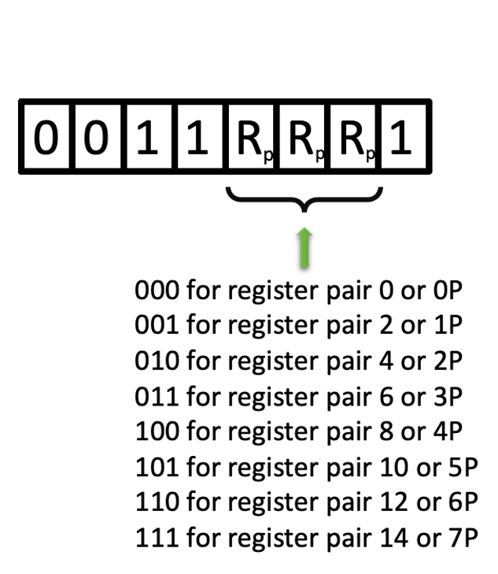

.. _hardware-machine-jin:

JIN
===
.. include:: ../../global.rst

.. toctree::
   :hidden:

.. list-table::
   :widths: 25 75
   :header-rows: 0

   * - Name
     - Jump Indirect
   * - Function
     - Jump to an address within this page of ROM.
   * - Syntax
     - JIN(Rp)
   * - Assembled
     -
   * - Binary
     - 0011RPp1
   * - Decimal
     - 49, then incrementing by 2 until 63 (1st word)
   * - Hexadecimal
     - 0x31, then incrementing by 2 until 0x3F (1st word)
   * - Symbolic
     - .. image:: images/jin-sym.png
          :scale: 50%
   * - Execution
     - 1 words 8-bit code and an execution time of 10.3 |mu| sec
   * - Side-effects
     - Not Applicable
   * - Implemented
     - jin_

.. rubric:: Detailed Description

Program execution is transferred to the instruction at location ADDR, which may
be anywhere in memory. (If the JUN is located in **ROM**, ADDR is a ROM address;
if located in **program RAM**, ADDR is a program RAM address).

The carry bit is not affected.

.. rubric:: Example program

::

   / Example program
           org    0x3e4
           fim    0p 21
           jin    0p
           end

The FIM instruction loads register 0 with the value 1 and register 1 with the
value 5.
The JIN instruction then causes a jump to location 0x315.

.. rubric:: Note:
If the JIN instruction is located in the last location of a page in memory,
the highest 4 bits of the program counter are incremented by one, causing
control to be transferred to the corresponding location on the next page.
If the above example, the JIN had been located at address 255 decimal (0x0FF)
then control would have been transferred to address 0x115, not 0x015.

**This is dangerous programming practice, and should be avoided whenever possible.**

.. _jun: https://github.com/alshapton/Pyntel4004/blob/5e9f4253d8a412f6a3ec8fca5e3acfc88e0861c3/pyntel4004/src/hardware/machine.py#L208
