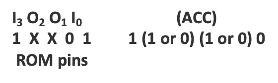

.. _hardware-machine-rdr:

RDR
===

.. include:: ../../global.rst

.. list-table::
   :widths: 25 75
   :header-rows: 0

   * - Name
     - Read ROM Port
   * - Function
     - The data present at the input lines of the previously selected |br|
       ROM chip is transferred to the accumulator.
   * - Syntax
     - RDR
   * - Assembled
     -
   * - Binary
     - 11101010
   * - Decimal
     - 234
   * - Hexadecimal
     - 0xEA
   * - Symbolic
     - .. image:: images/rdr-sym.png
          :scale: 50%
   * - Execution
     - 1 word, 8-bit code and an execution time of 10.8 |mu| sec
   * - Side-effects
     - Not Applicable
   * - Implemented
     - rdr_

.. rubric:: Detailed Description

The ROM port specified by the last SRC instruction is read. 
When using the 4001 ROM, each of the 4 lines of the port may be an input or an output line; 
the data on the input lines is transferred to the corresponding bits of the accumulator. 
Any output lines cause either a 0 or a 1 to be transferred to the corresponding 
bits of the accumulator. 

The opcode for this instruction does not contain any additional data:

.. rubric:: Example

The following instructions will read the contents of the port associated with ROM 
number 10 into the accumulator.

::

    / Example
            FIM   3P    160
            SRC   3P
            RDR

The `rdr` operation above is carried out as follows:

::

        Accumulator   =   1 0 1 0
     Data Character   =   0 1 1 1    
     Carry            =         0  
                          -------
        Result      1     0 0 0 1  
                

The accumulator contains 1 and the carry bit is set.

If the leftmost I/O line is an output line and the remaining I/O lines are input 
lines containing 010b, then the accumulator will contain either 1010b or 0010b.

.. rubric:: Note

On the INTELLEC 4, a ROM port may be used for either input or output. 
If programs tested on the INTELLEC 4 are to be run later with a 4001 ROM,
the programmer must be careful not to use one port for both functions.

.. rubric:: Note

Whether a 0 or a 1 is transferred is a function of the hardware and not under 
control of the programmer. That is to say, when a 4001 ROM chip is ordered, 
it is required to determine **at that stage** what the functionality of the pins
should be. Once ordered, the decision cannot be reverted. An order form can be
downloaded :download:`here <../../intro/resources/Intel-4001-Custom-ROM-Order-Form.pdf>`

.. _rdr: https://github.com/alshapton/Pyntel4004/blob/5e9f4253d8a412f6a3ec8fca5e3acfc88e0861c3/pyntel4004/src/hardware/machine.py#L208
