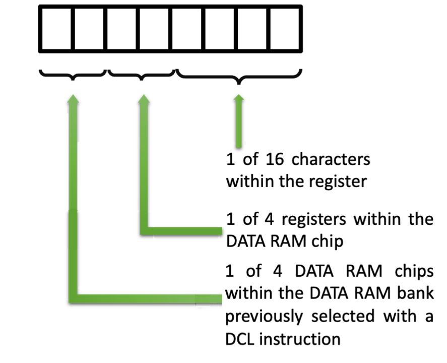
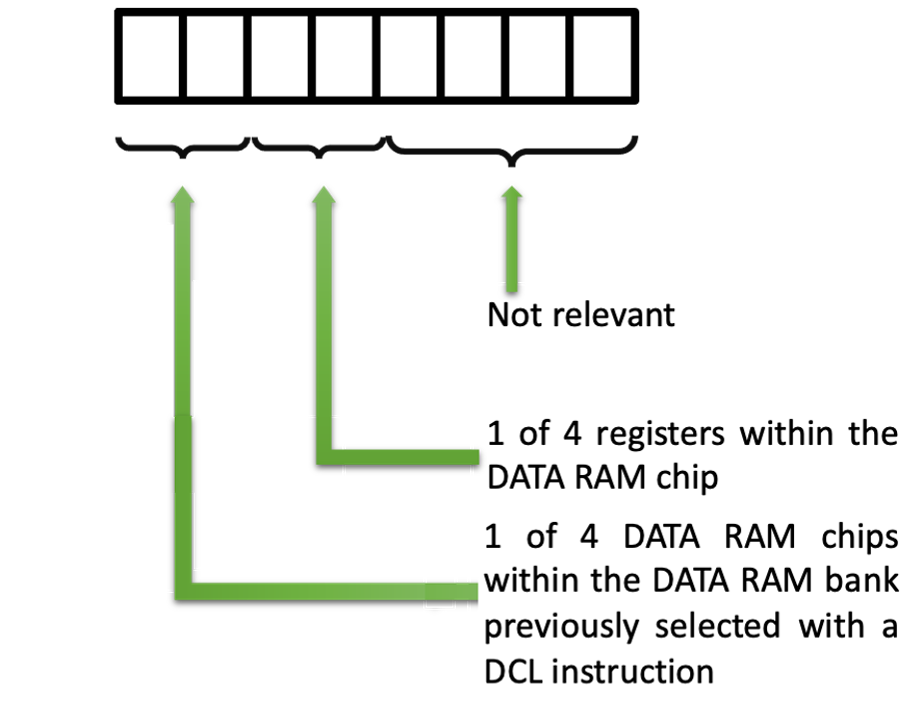
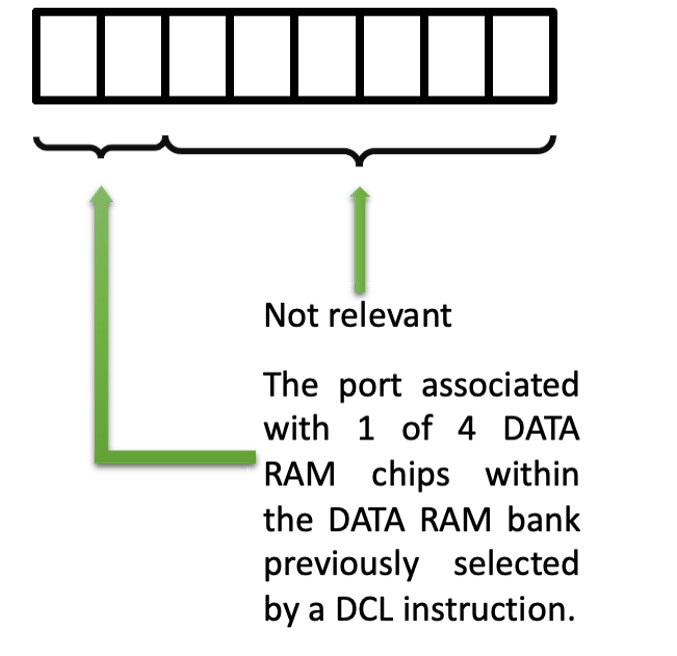
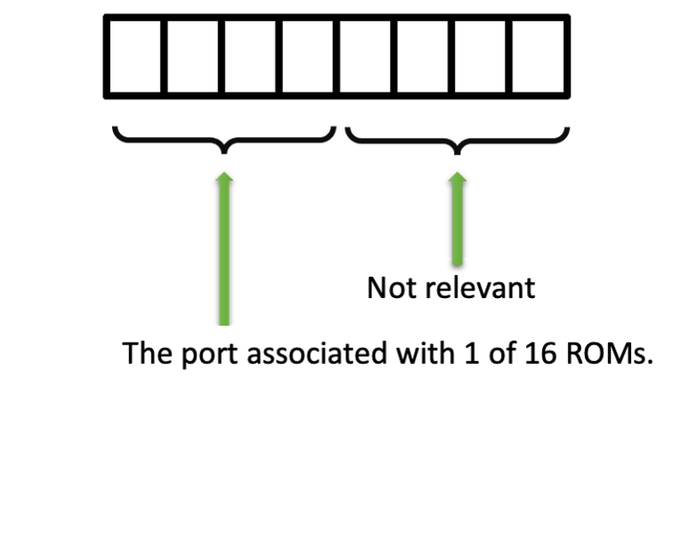

.. _hardware-machine-src:

SRC
===

.. include:: ../../global.rst

.. toctree::
   :hidden:

.. list-table::
   :widths: 25 75
   :header-rows: 0

   * - Name
     - Send Register Control
   * - Function
     - The 8 bits contained in the register pair specified by RP are used |br|
       as an address. This address may designate a particular DATA RAM |br|
       data character, a DATA RAM status character, a RAM output port, or |br|
       a ROM input/output port.
   * - Syntax
     - SRC(RPp)
   * - Assembled
     -
   * - Binary
     - 0010RPp1
   * - Decimal
     - 33, then incrementing by 2 until 47 (1st word)
   * - Hexadecimal
     - 0x21, then incrementing by 2 until 0x2F (1st word)
   * - Symbolic
     - .. image:: images/src-sym.png
          :scale: 50%
   * - Execution
     - 1 words, 8-bit code and an execution time of 10.3 |mu| sec
   * - Side-effects
     - Not Applicable
   * - Implemented
     - src_

.. rubric:: Detailed Description

The address contained within the specified register pair designates either
a particular DATA RAM data character, a DATA RAM status character,
a RAM output port, or a ROM input/output port.
However, the address designates all of these simultaneously; it is up to
the programmer to then write the correct I/O or RAM instruction to access
the proper entity.

The disassembly of the instruction below shows how the register pair are
represented in the opcode.

.. image:: images/src.png
   :scale: 50%
   :align: center

The address sent by the SRC remains in effect until changed by a subsequent SRC.

The only DATA RAM bank which receives the SRC address is the one selected by the last previous DCL instruction.

The 8 bits of the address sent by the SRC are interpreted in one of four ways,
depending on the context as follows:

.. rubric:: When referring to a DATA RAM Character

.. rubric:: When referring to a DATA RAM Status Character

.. rubric:: When referring to a DATA RAM Output Port

.. rubric:: When referring to a ROM I/O Port

.. rubric:: Example program

::

    / Example program
            org    ram
            fim    1p  180
            src    1p
            end

.. _src: https://github.com/alshapton/Pyntel4004/blob/5e9f4253d8a412f6a3ec8fca5e3acfc88e0861c3/pyntel4004/src/hardware/machine.py#L208
