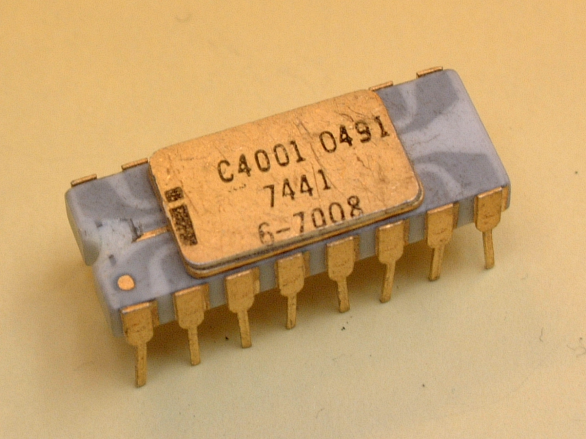
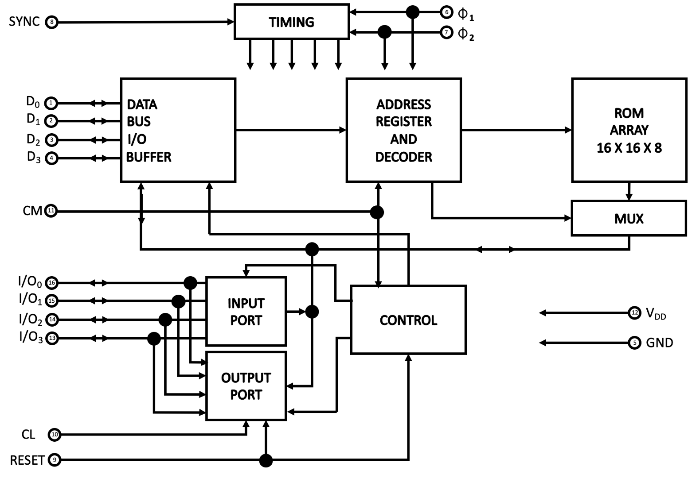
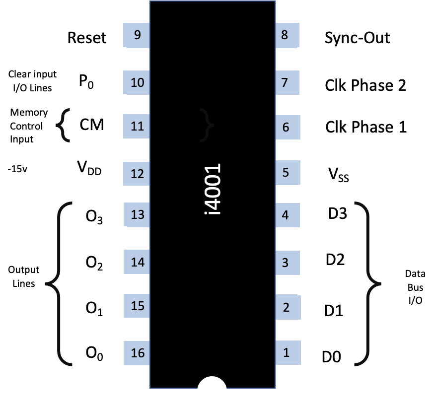

.. _4001:

The Intel 4001 Chip
===================

.. include:: ../global.rst

The Intel 4001 chip was introduced in 1971 as part of the Intel 4000 family; a fully decoded static Random Access Memory chip, fabricated with P-channel silicon gate MOS technology

It is a 2048-bit `metal mask programmable <https://en.wikipedia.org/wiki/Programmable_logic_device>`_ ROM providing custom microprogramming 
capability for the MCS-4 micro computer set. It is organised as 256 x 8-bit words.

Logically, the Intel 4001 is set out as shown:

The circled numbers relate to the pins as shown below:

Address and data are transferred in and out by time multiplexing on 4 data bus lines.
Timing is internally generated using two clock signals |phi| :subscript:`1` and |phi| :subscript:`2`, and a SYNC signal
supplied by the 4004. Addressed are received from the CPU on three time periods
following SYNC, and select 1 out of 256 words and 1 out of 16 ROMs.

For that purpose, each ROM is identified #0, 1, 2, through 15 by metal option.
A Command Line (CM) is also provided and its scope is to select a ROM bank
(group of 16 ROM’s).

During the two time periods (M :subscript:`1` & M :subscript:`2`) following the addressing time, information is
transferred from the ROM to the data bus lines.

A second mode of operation of the ROM is as an Input/output control device.
In that mode, a ROM chip will route information to and from  data bus lines
in and out of 4 I/O external lines. Each chip has the capability to identify
itself for an I/O port operation, recognise an I/O port instruction and decide
whether it is an Input or Output operation and execute the instruction.

An external signal (CL) will asynchronously clear the output register during normal operation.
All internal flip flops (including the output register) will be reset when the RESET line
goes low (negative voltage).

Each I/O pin can be uniquely chosen as either an input or output port by metal option when ordering.
An example order form can be downloaded :download:`here <resources/Intel-4001-Custom-ROM-Order-Form.pdf>`
Direct or inverted input or output is optional.
An on-chip resistor at the input pins connected to either V :subscript:`dd` or V :subscript:`ss` is also optional
(see ordering information on page 12).

