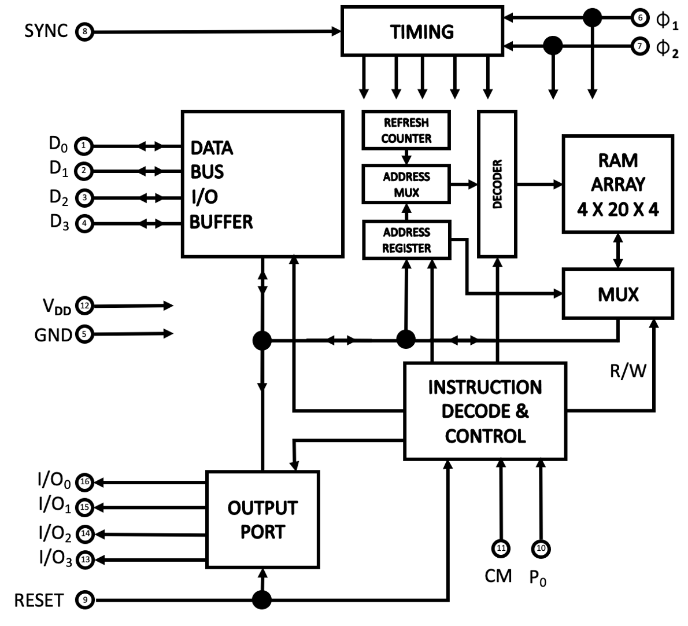
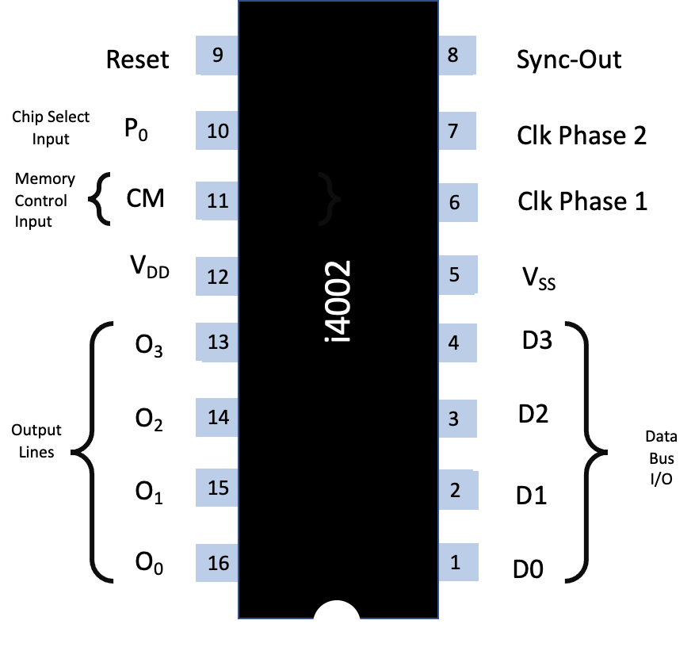
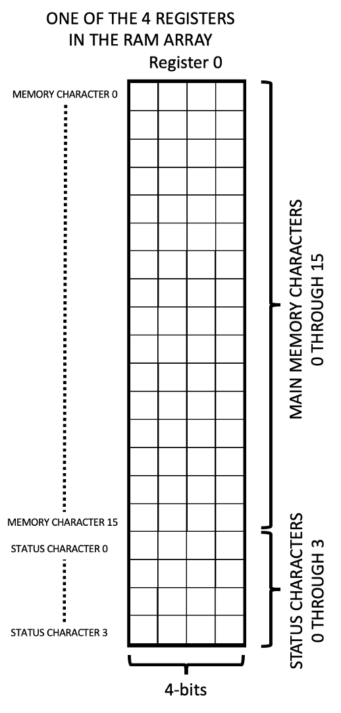
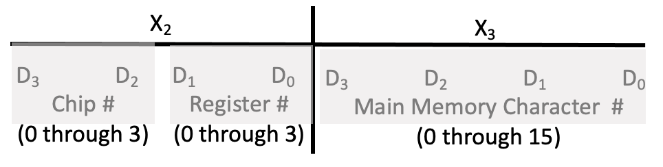

.. _4002:

The Intel 4002 Chip
===================

.. include:: ../global.rst

.. image:: images/intel4002chip.png
   :scale: 13%

The Intel 4002 chip was introduced in 1971 as part of the Intel 4000 family; a 320-bit MOS RAM and 4-bit output port, fabricated with P-channel silicon gate MOS technology

The 4002 was designed to be used with other MCS-4/40 devices such as the 4004 CPU.
The chip was available in two different metal options 4002-1 and 4002-2 this was to make it possible to extend the chip selection so that 4pcs of 4002 chips could be connected to the 4004 CPU without any external chip selection logic. 
Although produced by Intel, National Semiconductors was the only second source.

Logically, the Intel 4002 is set out as shown:

The circled numbers relate to the pins as shown below:

The 4002 performs two functions. As a RAM, it stores 320 bits arranged in 4 registers
of 20 x 4-bit characters each (16 main memory characters and 4 status characters).

|br|
|br|
|br|
|br|
|br|
|br|

In the RAM mode, the operation is as follows:
When the CPU executes an :ref:`SRC<hardware-machine-src>` instruction, it will send out the contents of 
the designated index register pair during X :subscript:`2` and X :subscript:`2` as an address to RAM,
and will activate 1 CM-RAM line at X :subscript:`2` for the `previously selected RAM bank`_
(see basic instruction cycle on page 5).

|br|
|br|
|br|
|br|
|br|
|br|
|br|
|br|
|br|

The data at X :subscript:`2` and X :subscript:`3` is interpreted as shown below:

As a vehicle for communication with peripheral devices, it is provided with 4 
output lines and associated control logic to perform output operations.

The status character locations (0 through 3) are selected by the OPA portion
of one of the I/O and RAM instructions.

For chip selection, the 4002 is available in two metal options, 4002-1 and 4002-2.
An extra pin, P :subscript:`0`, (which may be hard wired to either V :subscript:`DD` or V :subscript:`SS`) is also available for chip selection.

The chip number is assigned as follows:

.. list-table::
   :widths: 20 20 20 20 20
   :header-rows: 1

   * - Chip #
     - 4002 Option
     - P :subscript:`0`
     - D :subscript:`3` @  X :subscript:`2`
     - D :subscript:`2` @  X :subscript:`2`
   * - 0
     - 4002-1
     - GND
     - 0
     - 0
   * - 1
     - 4002-1
     - V :subscript:`DD`
     - 0
     - 1
   * - 2
     - 4002-2
     - GND
     - 1
     - 0
   * - 3
     - 4002-2
     - V :subscript:`DD`
     - 1
     - 1

Timing is internally generated using two clock signals X :subscript:`1` and X :subscript:`2`, and a SYNC signal provided by the 4004.
Internal refresh circuitry maintains data levels in the cells.

All communications with the system is through the data bus. The I/O port permits data out of the system.
When the external RESET signal goes low, the memory and all static flip-flops (including the output registers)
will be cleared. To fully clear the memory, the RESET signal must be maintained for at least 32 memory cycles 
(32 x 8 clock periods).

.. _`previously selected RAM bank`:

.. note:: 
   **Previously Selected Ram Bank** |br|
   Bank switching is accomplished by the CPU after receiving a “:ref:`DCL<hardware-machine-dcl>`” (designate command line) instruction.
   Prior to the execution of the DCL instruction the desired CM-RAM :subscript:`i` code has been stored in the accumulator (for example, 
   through an LDM instruction). During DCL the CM-RAM :subscript:`1` code is transferred from the accumulator to the CM-RAM register.
   The RAM bank is then selected starting with the next instruction.