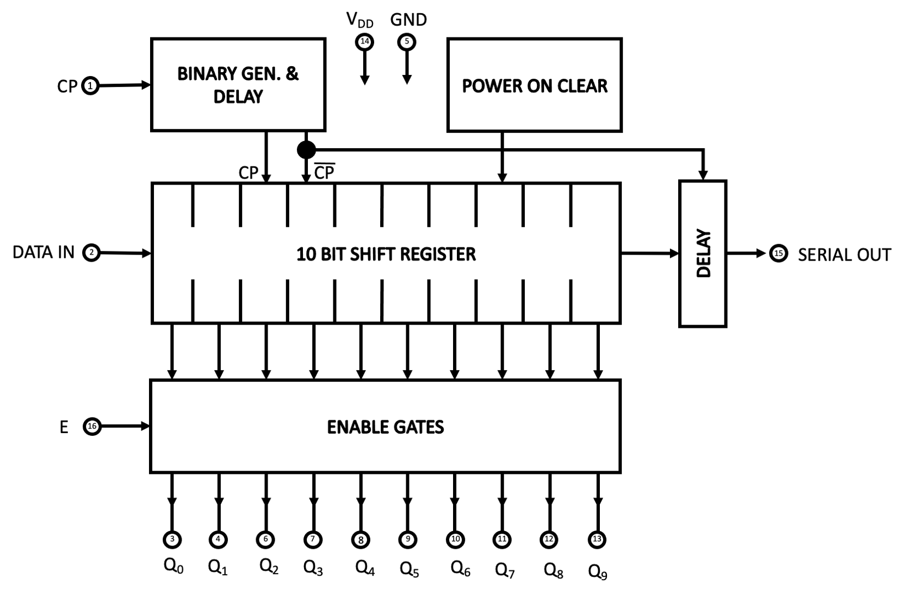

.. _4003:

The Intel 4003 Chip
===================

.. include:: ../global.rst

The Intel 4003 chip was introduced in 1971 as part of the Intel 4000 family; 10-bit Serial-in/Parallel-out, Serial-out Shift Register, fabricated with P-channel silicon gate MOS technology.

The 4003 was designed to be used with other MCS-4/40 devices such as the 4004 CPU.
Although produced by Intel, National Semiconductors was the only second source.

Logically, the Intel 4003 is set out as shown:

The circled numbers relate to the pins as shown below:

The 4003 is a 10-bit static shift register with serial-in, parallel-out and serial-out data.

Its function is to increase the number of output lines to interface with I/O devices such as keyboards, displays,
printers, teletypes, switchers, readers, A-D converters, etc.

Data is loaded serially and is available in parallel on 10 output lines which are accessed through enable logic.
When enabled (E = low), the shift register contents is read out; when not enabled (E = high), the parallel-out lines are at V :subscript:`SS`.
The serial-out line is not affected by the enable logic.

Data is also available serially permitting an indefinite number of similar devices to be cascaded together to provide shift register length multiples of 10.

The data shifting is controlled by the CP signal. An internal power-on-clear circuit (:download:`Patent number US3821785 <resources/US3753011.pdf>`) will clear the shift register (Q :subscript:`i` = V :subscript:`SS`) between the application
of a supply voltage and the first CP signal.
