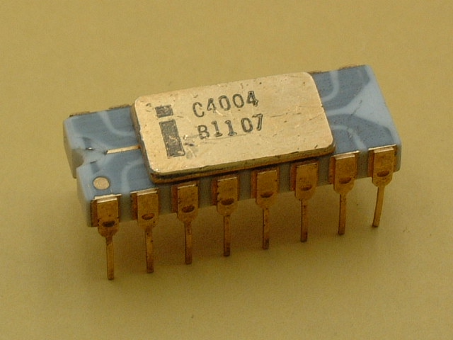
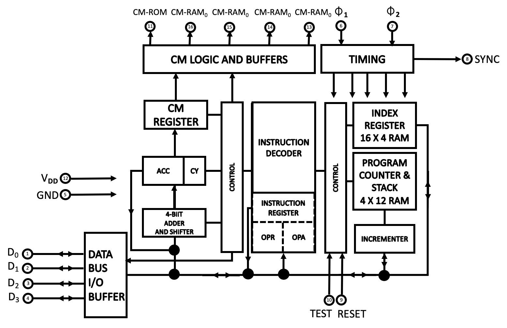
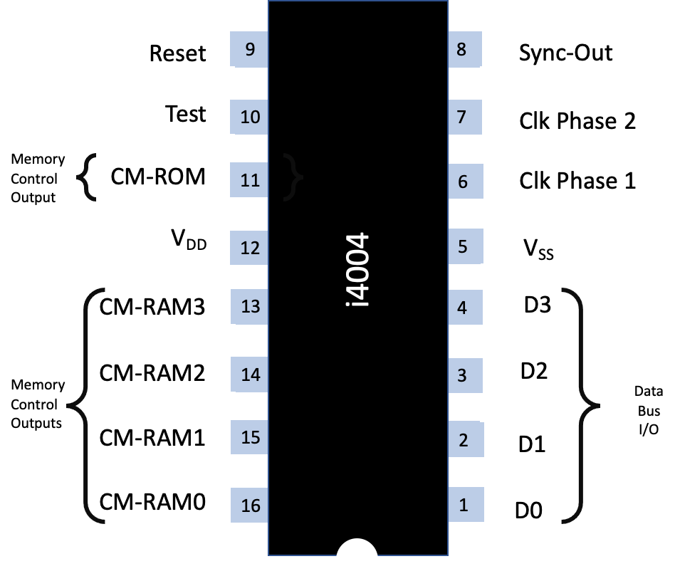

.. _4004:

The Intel 4004 Chip
===================

.. include:: ../global.rst

   
The Intel 4004 chip was introduced in 1971 as part of the Intel 4000 family; 4-bit central processing unit (CPU), fabricated with P-channel silicon gate MOS technology.

The 4004 was designed to be used with other members of the MCS-4/40 family (4001, 4002, 4003).

The :ref:`packaging<packaging>` of the Intel 4004 (and the Second Source manufacturers) are shown below:

.. csv-table::
   :header: "Manufacturer", "Model", "Package"
   :widths: 40, 20, 40

   "Manufacturer","Model","Package"
   "Intel","C4004","16-pin Ceramic DIP"
   "Intel","D4004","16-pin Ceramic DIP"
   "Intel","P4004","16-pin Plastic DIP"
   "National Semiconductor","INS4004D","16-pin Ceramic DIP"
   "National Semiconductor","INS4004J","16-pin side-brazed Ceramic DIP"
   "Hitachi","HD35404","16-pin DIP"
   "Microsystems International","MF7114",""

Internally, the 4004 is a 4-bit microprocessor with 8-bit instructions. It is clocked at a frequency of 500KHz - 740KHz.
It contains 4096x8-bit ROM and 1280x4-bit RAM, with 2,300 transistors at a 10 micron definition. 
There are 45 instructions (46 including NOP) with a 4 level stack and sixteen 4-bit (or eight 8-bit) registers

The hardware configuration is :ref:`here<hardware4004>`.

Logically, the Intel 4004 is set out as shown:

.. rubric:: Internal

.. image:: /intro/manual/images/4004-logic-diag.png
          :scale: 50%
          :align: center

.. rubric:: including external

The circled numbers relate to the pins as shown below:

The CPU consists of the following components:

.. csv-table::
   :header: "", "Component"
   :widths: 20,80

   "a","4-bit adder"
   "b","64-bit (16 x 4) index register"
   "c","48-bit Program Counter"
   "d","Stack (nesting up to 3 levels if possible)"
   "e","Address incrementer"
   "f","8-bit instruction register and decoder"
   "g","Control logic"

Information flows between the 4004 and the other chips through a 4-line data bus.
One 4004 may be combined with up to 48 ROM (4001) and RAM (4002) chips in any combination.

A typical machine cycle starts with the CPU sending a synchronisation signal (SYNC)
to the ROMs and RAMs. Next, 12 bits of ROM address are sent to the data bus using three clock
cycles (@ 0.75Mhz). The address is then incremented by one and stored in the Program Counter.

The selected ROM sends back 8 bits of instruction or data during the following two clock cycles.

This information is stored in two registers: OPR and OPA. The next three clock cycles are used to
execute the instruction. (See Basic Instruction Cycle on Page 5.)

The ROM bank is controlled by a command ROM control signal (CM-ROM) and up to four RAM banks are 
controlled by four RAM control signals (CM-RAM :subscript:`0`, CM-RAM :subscript:`1`, CM-RAM :subscript:`2`, CM-RAM :subscript:`3`) 

`Bank switching`_ is accomplished by the execution of a “:ref:`DCL<hardware-machine-dcl>`” instruction.

An input test signal (TEST) is used in conjunction with the jump on condition (":ref:`JCN<hardware-machine-jcn>`") instruction.
An external RESET signal is used to clear all registers and flip-flops. To fully clear all registers, the RESET signal
must be applied for at least 8 memory cycles (8 x 8 clock periods). After RESET the program will start from "0"
step and CM-RAM :subscript:`0` will be selected.

The instruction repertoire of the 4004 consists of :

.. csv-table::
   :header: "Instruction Type", "Number"
   :widths: 20,80

   "Machine instructions (5 of which are double length)", "16"
   "Accumulator group instructions", "14"
   "Input/output and RAM instructions", "16"
   "", ""
   "Total", "45"
   "", ""
   "No-Operation", "1"
   "**TOTAL**", "**46**"
 

.. _`Bank Switching`:

.. note:: 
   **Bank Switching** |br|
   Bank switching is accomplished by the CPU after receiving a "DCL" (designate command line) instruction.
   Prior to the execution of the DCL instruction the desired CM-RAM :subscript:`i` code has been stored in the accumulator (for example, 
   through an LDM instruction). |br|
   During DCL the CM-RAM :subscript:`i` code is transferred from the accumulator to the CM-RAM register.
   The RAM bank is then selected starting with the next instruction.
