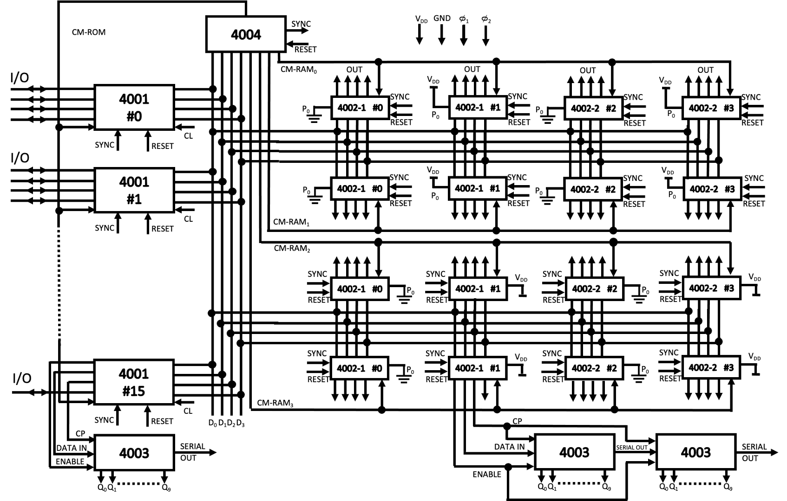
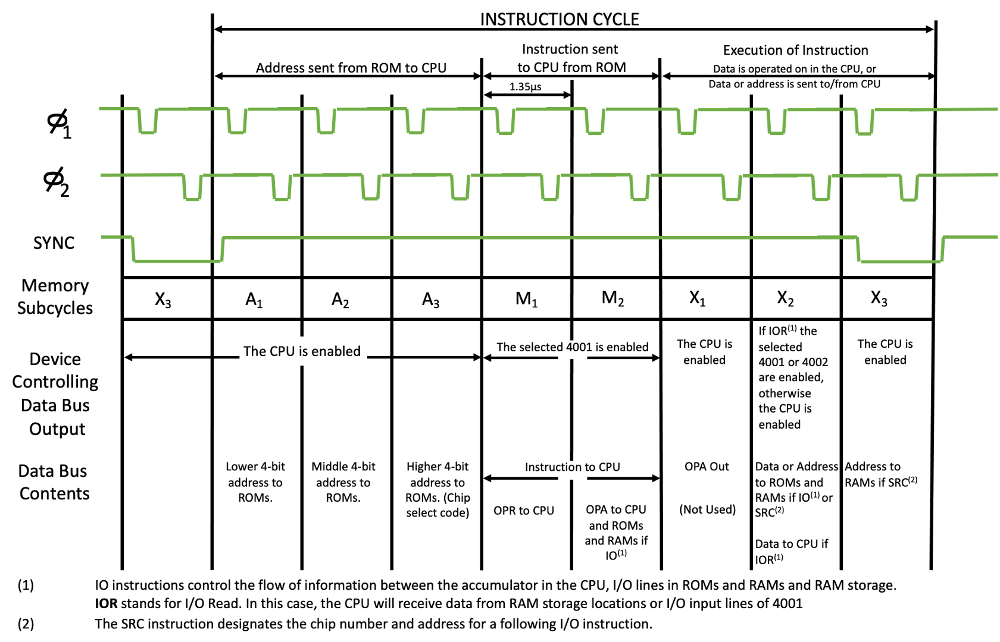

.. _interconnect:

MCS-4 System Interconnections
=============================

.. include:: ../global.rst

The MCS-4 uses a 10.8 |mu| sec instruction cycle. The CPU (4004) generates a synchronisation (SYNC)
signal, indicating the start of an instruction cycle, and sends it to the ROMs (4001) and RAMs (4002).

Basic instruction execution requires 8 or 16 cycles of a 750 kHz clock. In a typical sequence, the 
CPU sends 12 bits of address to the ROMs in three cycles (A :subscript:`1`, A :subscript:`2`, A :subscript:`3`). The selected ROM sends back 8 
bits of instruction (OPR, OPA) to the CPU in the next two cycles (M :subscript:`1`, M :subscript:`2`). The instruction is then 
interpreted and executed in the final 3 cycles (X :subscript:`1`, X :subscript:`2`, X :subscript:`3`).

The CPU, RAMs and ROMs can be controlled by an external RESET line. While RESET is activated the contents
of the registers and flip-flops are cleared. After REST, the CPU will start from address 0 and CM-RAM :subscript:`0` is selected.

The **MCS-4** can have up to 4K x 8-bit ROM words, 1280 x 4-bit RAM characters and 128 I/O lines, without requiring any interface 
logic. By adding a few extra gates, the **MCS-4** can have up to 48 RAM and ROM packages in any combination and 192 I/O lines.

The 4001, 4002, and 4004 are interconnected by a 4-line data bus (D :subscript:`0`, D :subscript:`1`, D :subscript:`2`, D :subscript:`3`) 
used for all information flow between the chips except for the control signals sent by the CPU on 6 additional lines.
The interconnection of the MCS-4 system is shown below. Note that an expanded configuration is shown. The minimum system configuration
consists of one CPU (4004), and one ROM (4001). The timing diagram below shows the activity
on the data bus during each clock period, and how a basic instruction rate is subdivided.

Each data bus output buffer has 3 possible states - "1", "0", and "floating". At any given time, only one output buffer is allowed 
to drive a data line, therefore, all the other buffers must be in a floating condition. However, more than one input buffer per data
line can receive data at the same time.

The **MCS-4** has a very powerful :ref:`instruction set<instruction_summary>` that allows both binary and decimal arithmetic. It allows 
conditional branching, jump to subroutine and provides for the efficient use of ROM look up tables by indirect fetching. 
Typically, 2 8-bit numbers can be added in 850 |mu| secs.

|br|
|br|

