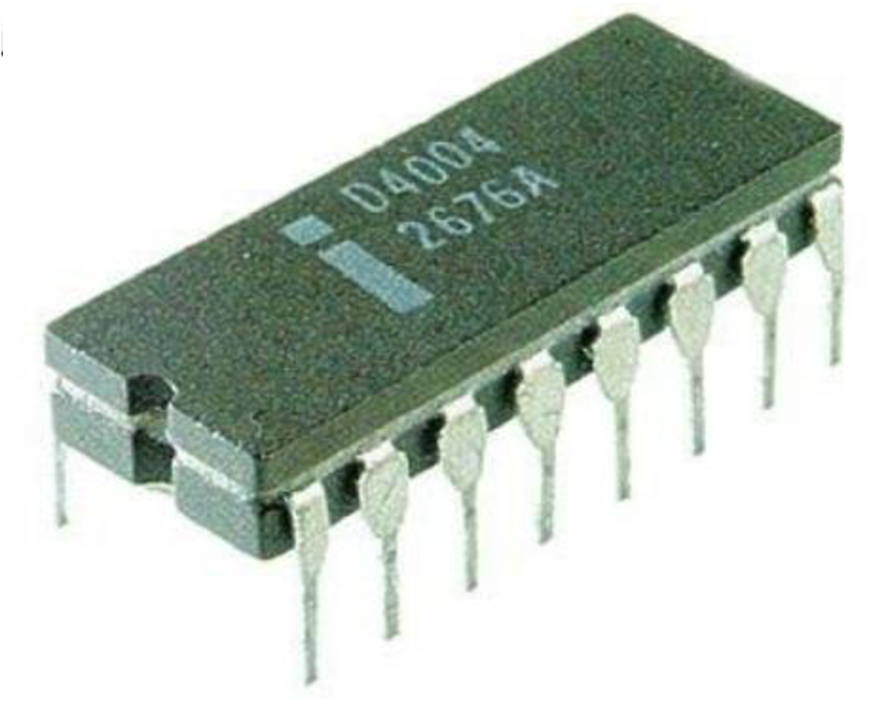

.. _main:

Intel 4004 Chip History
=======================

The 4000 Family (A.K.A. Busicom Chip Set / MCS-4 Chip Set)

The 4000 family consisted of four different chips:

 - a 2048-bit ROM with a 4-bit programmable input-output port (4001) :ref:`4001`
 - a 4-registers x 20-locations x 4-bit RAM data memory with a 4-bit output port (4002)
 - an input-output expansion chip, consisting of a static shift register with serial input and serial and parallel output (4003)
 - a 4-bit CPU chip (4004)

All the chips were packaged in 16-pin, dual-in-line packages.
This package restriction was imposed by Intel’s management, who at the time
considered any package with more that 16 pins uneconomical, despite the fact
that 40-pin packages were widely used by other semiconductor companies.

This unfortunate choice considerably constrained the performance of the system.
Address and data had to be multiplexed onto the pins (one of the claims of
patent no. 3,821,715), causing a major penalty in the instruction cycle execution.
The instruction cycle of 10.8 microseconds could have been easily reduced to
4 microseconds by a more appropriate package choice.

The 4000-family was completed by March 1971, in production by June 1971 and
introduced to the general market in November 1971 with the name MCS-4.

Text © intel4004.com
