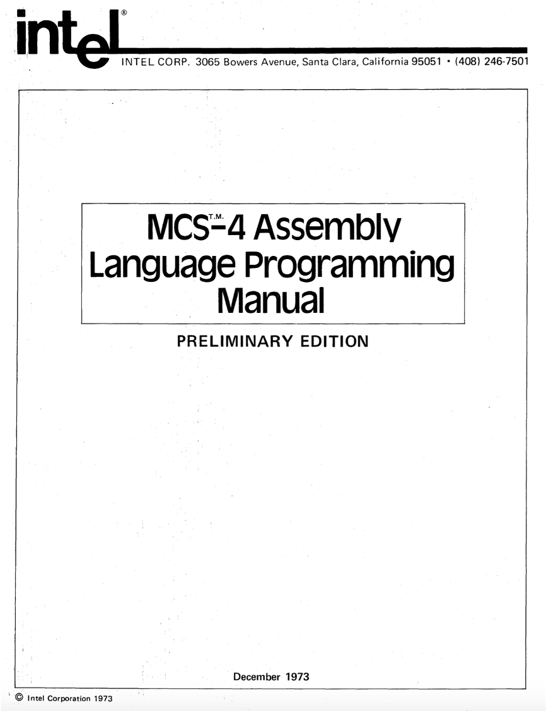

.. _mcs4:

.. include:: ../../global.rst

MCS-4 Assembly Language Programming Manual
==========================================

|br|

.. toctree::

   acknowledgements
   glossary
   introduction
   organization
   registers
   accumulator
   memories
   stack
   input_and_output
   representation
   memory_addressing
   carry
   4004_instruction_set
   data_statements
   constant_data
   instruction_summary
   instruction_machine_codes
   programming_techniques
   powers_of_two
   powers_of_sixteen
   powers_of_10
   hexadecimal_decimal_integer_conversion
   hexadecimal_arithmetic
   pseudo_instructions

