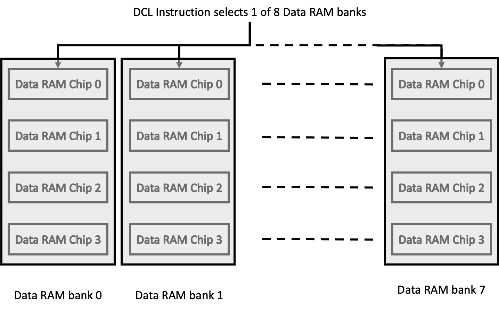

.. _ram:

Data Random Access Memory (RAM)
===============================

.. include:: ../../global.rst

As its name implies, **data random access memory** (DATA RAM) is used for the 
temporary storage of data by programs.

The RAM is laid out as shown below:

|br|

.. centered:: Data RAM bank organisation

|br|

.. centered:: RAM chip organisation

|br|
|br|

In order to address a 4-bit character of DATA RAM, the programmer first uses a ":ref:`DCL <hardware-machine-dcl>`" instruction 
to choose one of a maximum of eight DATA RAM BANKS. 

An eight bit address is then sent via an ":ref:`SRC <hardware-machine-src>`" instruction which chooses one of four DATA RAM CHIPS
within the DATA RAM BANK, one of four 16-character DATA RAM REGISTERS within the DATA RAM CHIP, and 
one of 16 4-bit characters within the DATA RAM REGISTER. 

Within any particular DATA RAM BANK, then, addresses 0 - 63 indicate which of
the 64 directly addressable characters of DATA RAM CHIP 0 is to be addressed, |br|
addresses 64 - 127 correspond to the characters of CHIP 1, |br|
addresses 128 - 191 correspond to CHIP 2, and |br|
addresses 192 - 255 correspond to CHIP 3. |br|

In addition, each DATA RAM REGISTER has four 4-bit STATUS characters associated with it. 
These status characters may be read and written like the data characters, but are accessed by 
special instructions as described :ref:`here <hardware-machine-rdn>` and :ref:`here <hardware-machine-wrn>`
